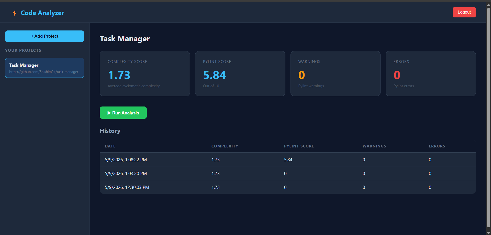

# Code Analyzer

A web application that analyzes Python repositories for code quality metrics including cyclomatic complexity, pylint score, warnings, and errors.

Built as a personal project to bridge my professional experience in C++ static analysis with Python development. The tool applies code quality concepts I worked with directly - static analysis for rule violations and cyclomatic complexity for measuring code maintainability, but for Python codebases using pylint and radon.

## Tech Stack

- **Backend:** Python, Flask, SQLAlchemy
- **Authentication:** JWT (JSON Web Tokens)
- **Database:** SQLite (development), PostgreSQL (production)
- **Code Analysis:** Radon, Pylint
- **Deployment:** Render

## Features

- User registration and login with JWT authentication
- Add GitHub repositories as projects
- Analyze Python code for:
  - Cyclomatic complexity score
  - Pylint code quality score
  - Warning and error count
- View analysis history and trends
- Background processing for analysis tasks

## How to Run Locally

1. Clone the repository

   git clone https://github.com/Shishira24/code-analyzer.git
   cd code-analyzer

2. Install dependencies

   pip install -r requirements.txt

3. Create a `.env` file
DATABASE_URL=sqlite:///codeanalyzer.db
JWT_SECRET_KEY=yoursecretkey

4. Run the application

   python run.py

5. Open your browser at `http://127.0.0.1:5000`

## Project Structure
code_analyzer/
├── app/
│   ├── init.py        # App factory
│   ├── config.py          # Configuration
│   ├── models/            # Database models
│   ├── routes/            # API endpoints
│   └── services/          # Business logic
├── .env                   # Environment variables
├── requirements.txt       # Dependencies
└── run.py                 # Entry point

## API Endpoints

| Method | Endpoint | Description |
|--------|----------|-------------|
| POST | /auth/register | Register new user |
| POST | /auth/login | Login and get token |
| GET | /projects/ | Get all projects |
| POST | /projects/ | Create new project |
| DELETE | /projects/:id | Delete project |
| POST | /projects/:id/analyze | Trigger analysis |
| GET | /projects/:id/results | Get analysis results |